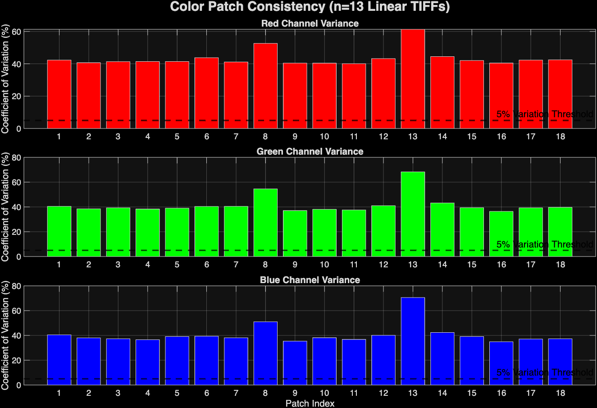
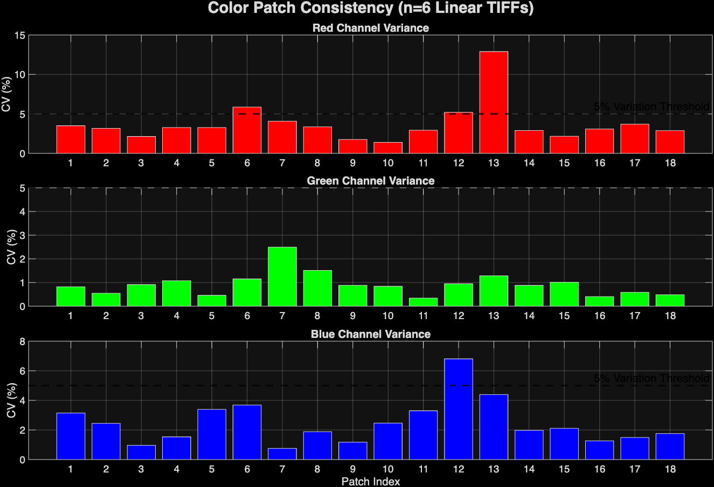
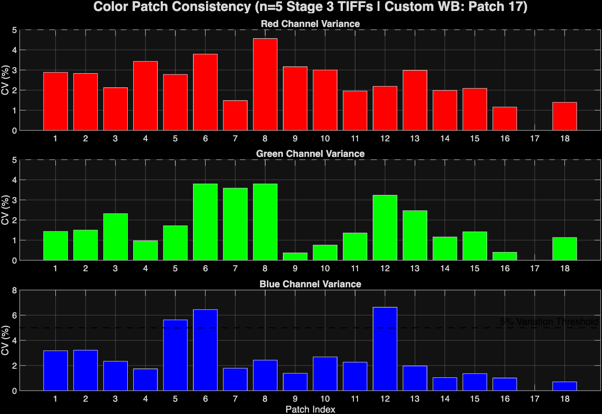
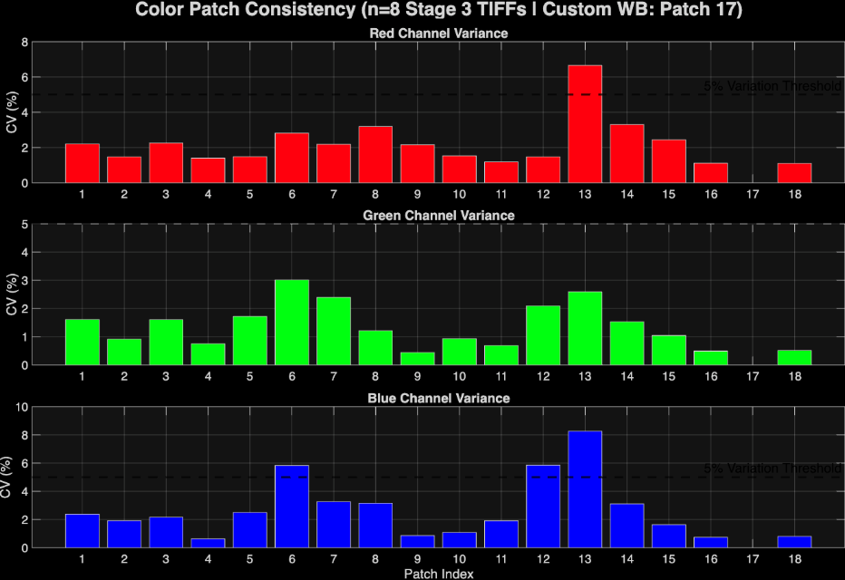
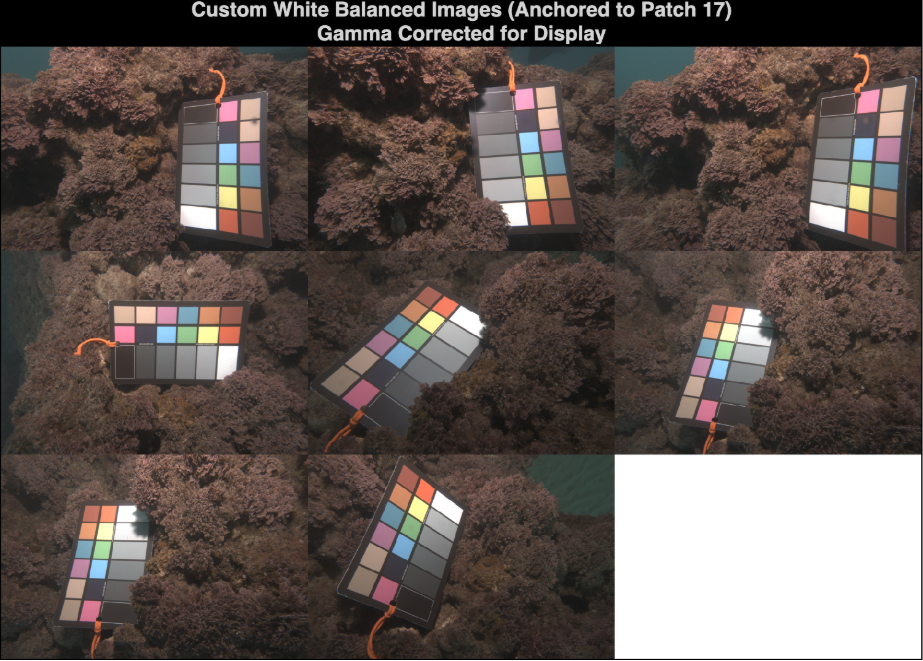
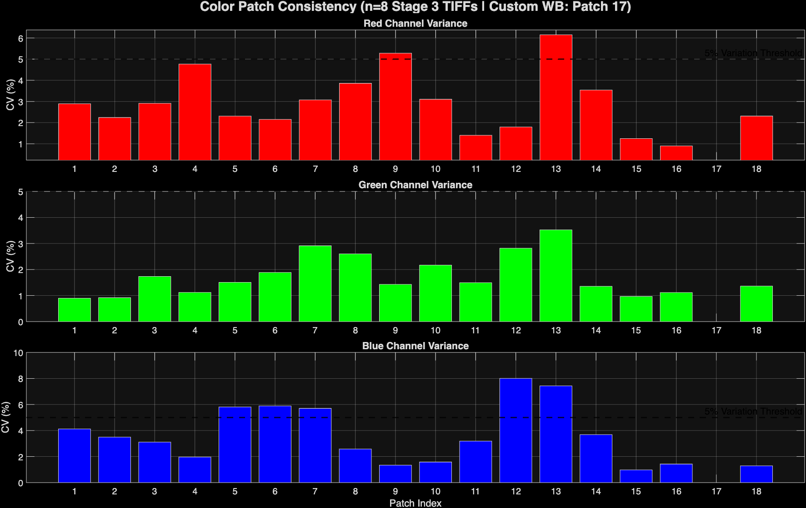
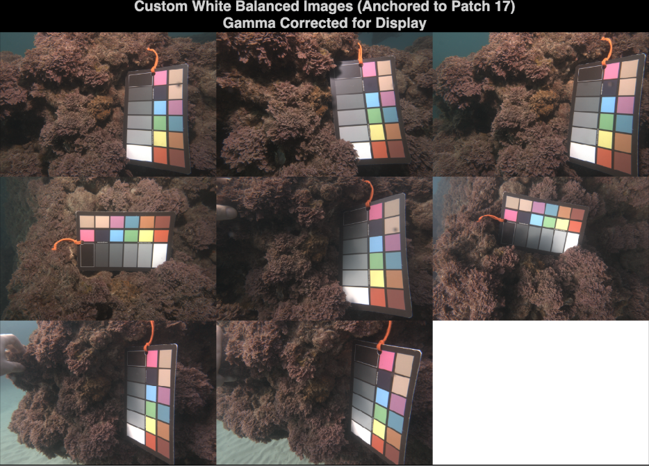
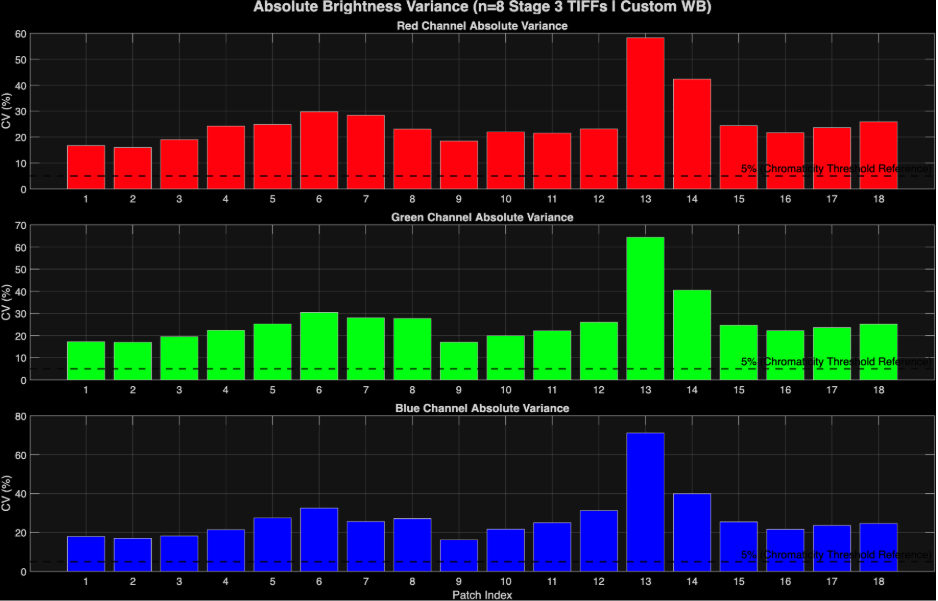

## Summary of Findings
* The best color consistency (lowest variation) was achieved by applying the custom white balance based on the 24% white patch to ambient images (Figure 3) and analyzing the chromaticity of the colors rather than raw brightness levels. 
* The strobe lit images also had a great consistency (Figure 4). 
* Using chromaticity instead of raw brightness levels appears to be an effective method of analyzing the colors across images even under different lighting conditions. 

## Analysis Log

A key aspect of using the color of images as scientific data is ensuring consistency across images. In this analysis, I am performing tests to assess variation in color levels across images. I start with a RAW image that I convert to a DNG file with Adobe DNG converter, which is then converted to a linear TIFF image with the DNG2tiff script. I have provided an overview of what the DNG2Tiff script does below, followed by the results of the analyses.

### DNG2tiff Script Stages Overview

Based on the script and standard camera processing workflows, here is a description of the four stages involved in converting RAW sensor data into a scientific image: 

#### Stage 1: RAW Bayer Data 
* This is the "purest" form of the image. 
* At this stage, the data is just a grid of values representing the light intensity captured by the sensor behind a Bayer Filter Mosaic. 
* **Appearance:** The image looks like a grayscale mosaic or a dark, noisy grid. 
* **State:** No color information has been calculated yet; each pixel only knows if it is Red, Green, or Blue based on its position in the sensor grid. 

#### Stage 2: Black Level Subtraction 
* Camera sensors never record a true "zero" for darkness due to electrical noise (dark current). 
* **Process:** The script identifies the sensor's baseline "floor" (the black level) and subtracts it from every pixel. 
* **Importance:** This is a crucial step for linearity; if you don't subtract the black level, your ratios will be mathematically incorrect because they are biased by a constant offset. 

#### Stage 3: Demosaicing (Color Interpolation) 
* Since each physical pixel on the sensor only records one color (R, G, or B), the script must "fill in the blanks" to create a full RGB image. 
* [**Process:** It uses neighboring pixels to estimate the missing color values for every single point on the grid. 
* **Appearance:** The image now looks like a "real" photo, but it will typically have a heavy green tint. This is because most camera sensors have twice as many green pixels as red or blue and are naturally more sensitive to green light. 

#### Stage 4: White Balancing 
* This is where the script applies multipliers to the R, G, and B channels to make neutral objects (like your grey patches) look neutral under the current lighting. 
* **Process:** It uses either the "As Shot" metadata from the camera or custom gains to scale the color channels.

## Results and Figure Progression

Using Ambient Underwater images (S1B_UWA_TIF) I ran them all through the DNG2Tiff script to stage 4 and then assessed their variation. The first version of the script I created (ColorConsistencyV1) compared the absolute brightness levels of each color channel in each patch and showed high variation (40-70%). It also forced the user to click through each corner of the color chart in each image, not storing the masks anywhere. Overall, quite tedious and not consistent. 

*Figure 1: Color consistency analysis of ambient UW images using raw brightness levels. WB done automatically by DNG2Tif script.* 

I upgraded this script with v2 and v3. These scripts introduced quality of life user enhancements and shifted the analysis from absolute brightness of each patch to chromaticity, which divides the brightness of the channel by the sum of all channels (R/R+G+B). This reduced the variation to lower levels, but not greatly. The green was the most consistent. 

*Figure 2: Color Consistency analysis on ambient UW images using chromaticity instead of brightness. WB done automatically by DNG2Tif script.* 

Now, I'm working to refine this color consistency and achieve a better coefficient of variation. First of all, I am going to reprocess all of the images using the stage 3 version of the dng2tiff script, which skips the automatic white balancing. Instead, I will utilize the greyworld hypothesis and base the white balancing on the physical grey patches of the color charts instead. Hopefully, this will improve the color consistency across the images. I will also run analyses that incorporate a variety of lighting scenarios, including strobe illumination.

*Figure 3: Color consistency analysis of ambient UW images using custom WB based on 24% patch.* 

Using the ambient images, I successfully reduced the variation, especially in the red channel, using a grey world hypothesis white balance on the 24% white patch. 

*Figure 4: Color Consistency Analysis of strobe-lit UW images using custom WB based on patch #17 (24%).* 

*Figure 5: Visual Inspection of corresponding images from Fig 4.*

*Figure 6: Analysis of a combination of ambient and strobe-lit images using custom 24% white balance.*

*Figure 7: Visuals of figure 6 analysis. First 4 are strobe and last 4 are ambient.* 

*Figure 8: Absolute brightness analysis version of fig 6 instead of chromaticity.* 