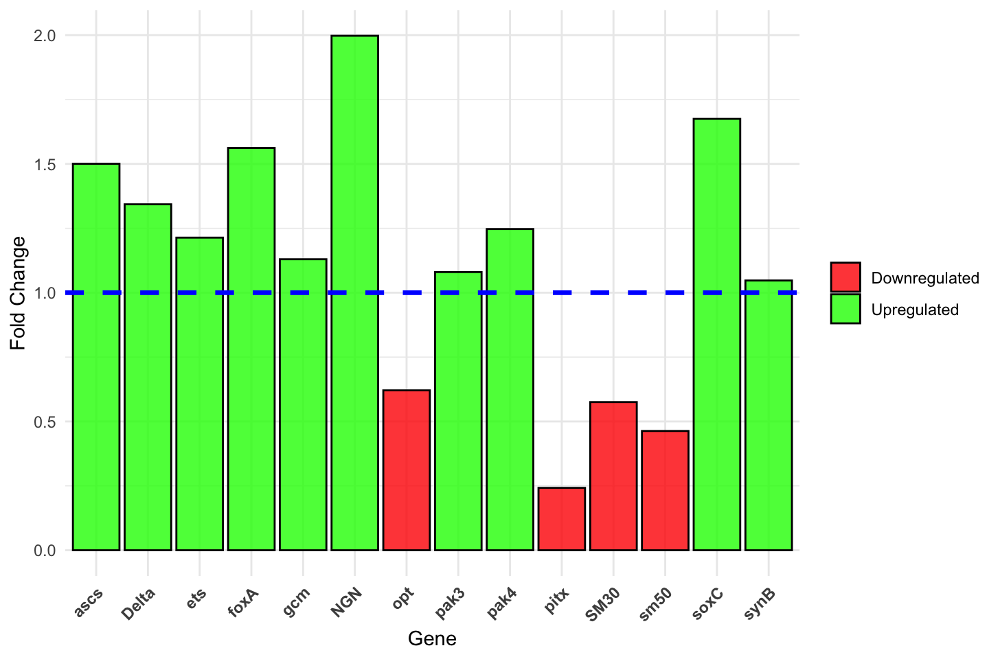

# Part 2: Interpreting qPCR Data using Relative Quantification

To understand how our inhibitor treatment affects gene expression compared to the DMSO control, we use relative quantification. The standard calculation for this is the **Delta-Delta Ct (△△Ct) Method** (Livak method).

This method relies on Cycle Threshold (Ct) values. A Ct value represents the number of PCR cycles required for the fluorescent signal to exceed background levels; therefore, a *lower* Ct value means there was a *higher* initial amount of target nucleic acid in the sample.

First, we look at the raw Ct values from the qPCR instrument. *Tubulin* acts as our stable reference (housekeeping) gene, remaining constant across both conditions. 

#### Table 1: Raw Cycle Threshold (Ct) Data

| Gene | DMSO Control | Inhibitor Treatment |
| :--- | :--- | :--- |
| **_Tubulin_ (Ref)** | 23.30 | 23.30 |
| **_ascs_** | 29.09 | 28.51 |
| **_Delta_** | 25.96 | 25.54 |
| **_ets_** | 24.72 | 24.44 |
| **_foxA_** | 24.37 | 23.72 |
| **_gcm_** | 28.35 | 28.18 |
| **_NGN_** | 28.35 | 27.35 |
| **_opt_** | 31.02 | 31.71 |
| **_pak3_** | 25.41 | 25.29 |
| **_pak4_** | 25.57 | 25.25 |
| **_pitx_** | 29.68 | 31.72 |
| **_SM30_** | 20.97 | 21.77 |
| **_sm50_** | 23.70 | 24.81 |
| **_soxC_** | 25.07 | 24.33 |
| **_synB_** | 24.13 | 24.06 |

### Step 1: First Normalization (△ Ct)

Next, we normalize the expression of our target genes to account for variations in starting RNA quantity and extraction efficiency. We calculate this by subtracting the Ct value of our reference gene (*Tubulin*, 23.30) from each target gene's Ct.

**Formula:** `△Ct = Ct (target gene) - Ct (reference gene)`

####Table 2: △ Ct Values for the DMSO Control and Inhibitor Treatments

| Gene | DMSO Control △Ct | Inhibitor Treatment △ Ct |
| :--- | :--- | :--- |
| **_ascs_** | 5.80 | 5.21 |
| **_Delta_** | 2.67 | 2.24 |
| **_ets_** | 1.42 | 1.14 |
| **_foxA_** | 1.07 | 0.43 |
| **_gcm_** | 5.06 | 4.88 |
| **_NGN_** | 5.06 | 4.06 |
| **_opt_** | 7.72 | 8.41 |
| **_pak3_** | 2.11 | 2.00 |
| **_pak4_** | 2.28 | 1.96 |
| **_pitx_** | 6.38 | 8.43 |
| **_SM30_** | -2.33 | -1.53 |
| **_sm50_** | 0.40 | 1.52 |
| **_soxC_** | 1.78 | 1.03 |
| **_synB_** | 0.83 | 0.76 |

### Step 2 & 3: △△Ct and Fold Change
Now, we determine the difference in the normalized expression between our experimental group (Inhibitor) and our baseline group (DMSO Control).

**Formula:** `△△Ct = △Ct (Treatment) - △Ct (Control)`

Because PCR is an exponential process, the △△Ct value is on a base-2 logarithmic scale. We convert it to a biologically intuitive, linear "Fold Change" value using the following formula:

**Formula:** `Fold Change = 2^(△△Ct)`

#### Table 3: △△Ct and Final Fold Change

| Gene | △△Ct (DDCT) | Fold Change |
| :--- | :--- | :--- |
| **_ascs_** | -0.59 | 1.50 |
| **_Delta_** | -0.43 | 1.34 |
| **_ets_** | -0.28 | 1.21 |
| **_foxA_** | -0.64 | 1.56 |
| **_gcm_** | -0.18 | 1.13 |
| **_NGN_** | -1.00 | 2.00 |
| **_opt_** | 0.69 | 0.62 |
| **_pak3_** | -0.11 | 1.08 |
| **_pak4_** | -0.32 | 1.25 |
| **_pitx_** | 2.05 | 0.24 |
| **_SM30_** | 0.80 | 0.58 |
| **_sm50_** | 1.11 | 0.46 |
| **_soxC_** | -0.74 | 1.68 |
| **_synB_** | -0.07 | 1.05 |

### Data Interpretation & Final Graph

**Visualizing the Data:**
Below is a bar chart visualizing the final Fold Change for each gene. The line across the graph at `Y = 1` represents our baseline DMSO Control. Bars that extend above this line indicate upregulation, while bars that drop below it indicate downregulation in response to the inhibitor.

1. **Upregulation (Fold Change > 1):** Several genes show values greater than 1, most notably ***NGN*** (Fold Change = ~2.00) and ***soxC*** (Fold Change = ~1.68). This means the inhibitor treatment caused these genes to be expressed at a higher level than normal. In the case of *NGN*, the expression level essentially doubled compared to the control group.

2. **Downregulation (Fold Change < 1):** Conversely, genes like ***pitx*** and ***sm50*** show a dramatic decrease. The fold change for *pitx* was 0.24, indicating severe downregulation. The gene is expressed at roughly one-quarter (1/4) of its normal control level.

3. **Interpretation:** These genes in this dataset are likely from the sea urchin embryo Gene Regulatory Network (GRN). In this context, the genes sm50 and sm30 are involved in biomineralization, while NGN and soxC are responsible for neural development, and pitx is involved in establishing spatial organization in the developing embryos. 
Therefore, the results suggest that the inhibitor treatment blocked the signaling pathways responsible for spatial organization and biomineralization while increasing the amount of neural development via the upregulation of NGN and soxC.