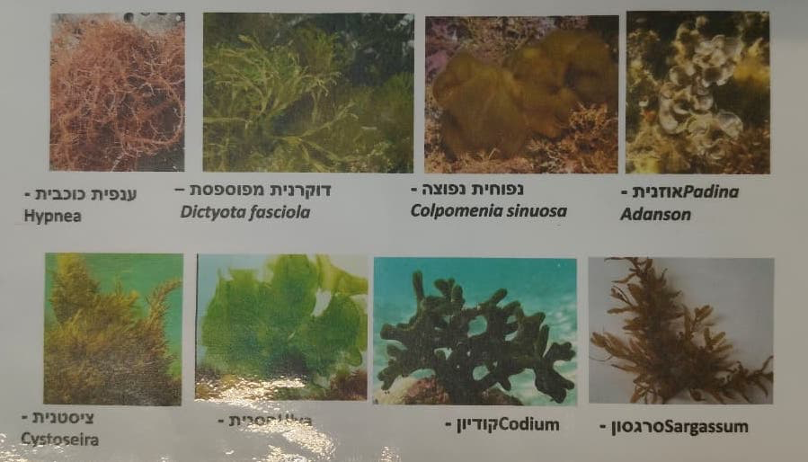
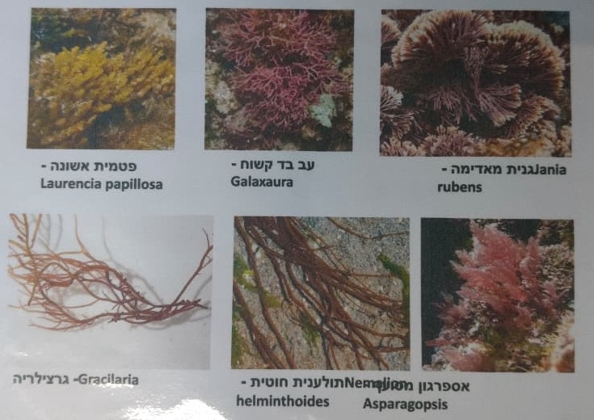
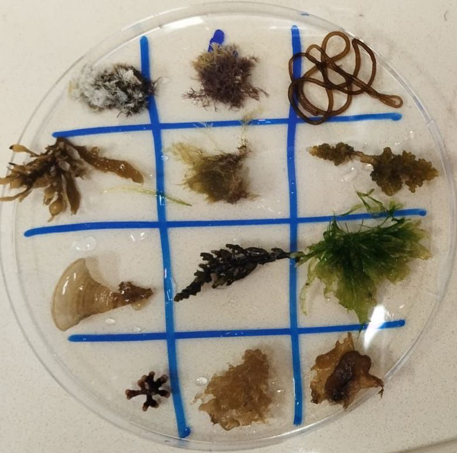
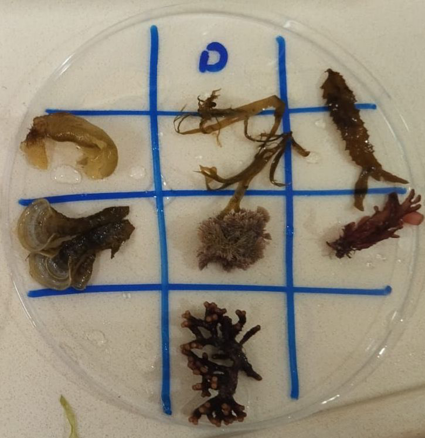
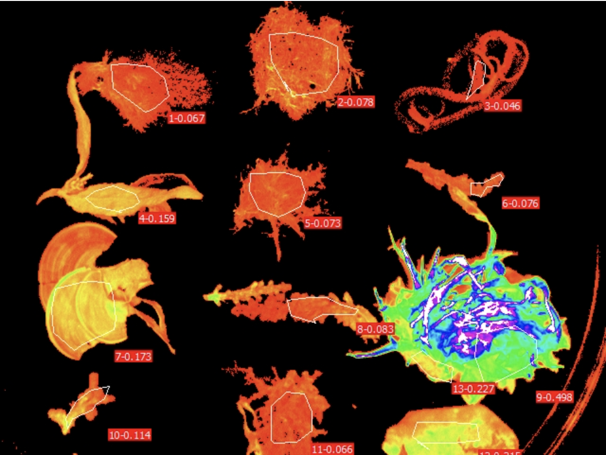
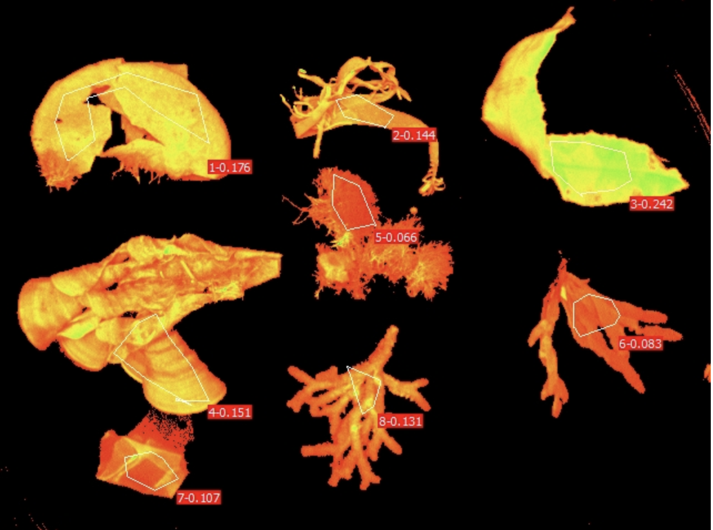
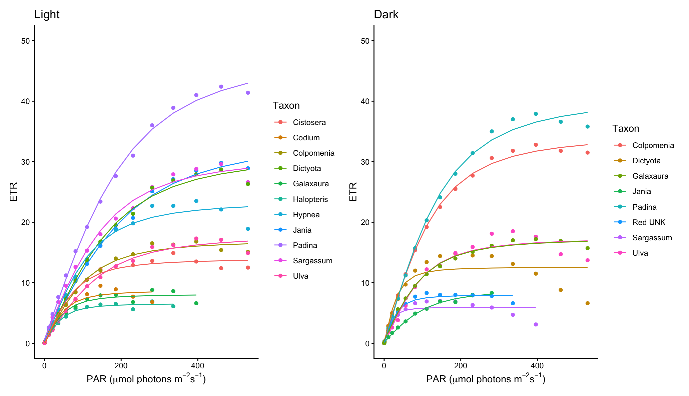
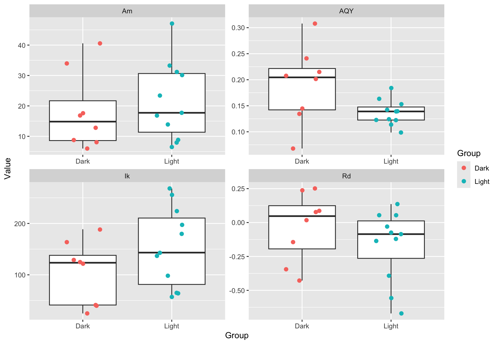
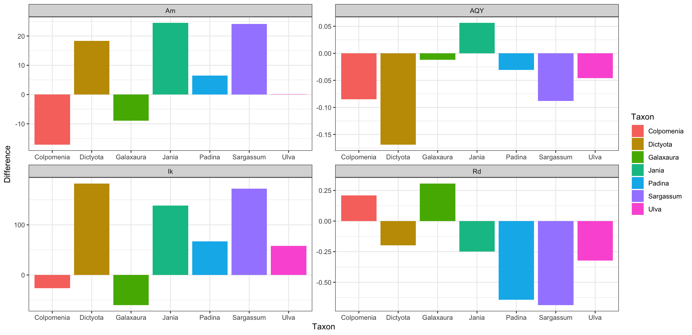

# Photophysiological Adaptation of Algae Report

**Boaz Abramson** 

**Research Methods B Spring 2026**

---

## Introduction

### Aim
The aim of this study is to compare the photophysiology of various Mediterranean algae species which were high-light (HL) acclimated versus low-light (LL) acclimated. While visiting the tidal platforms off the coast of Sdot Yam, students were tasked with collecting algae from sunlit areas and shaded areas. Photophysiological measurements were collected using a Pulse Amplitude Modulated (PAM) Fluorometer and later analyzed using R. 

### Experimental Design
This is a comparative study between high light (HL) acclimated algae and low light (LL) acclimated algae. 

**Independent variables:** Habitat light exposure (Categorical: High-light vs. Low-light)

**Dependent variables:** 

* **Dark-incubated/baseline parameters:** * Minimum fluorescence (F0)
    * Maximum fluorescence (Fm)
    * Variable fluorescence (Fv)
    * Maximum quantum yield (Fv / Fm)
* **Steady-state parameters:**
    * Effective quantum yield (ΦPSII)
    * Electron transport rate (ETR)
    * Non-photochemical quenching (NPQ)
* **Rapid Light Curve parameters:** 
	* Initial slope (α or AQY)
    * Maximum electron transport rate (ETRmax) = Asymptotic maximum (Am) = max photosynthesis (Pmax)
    * Minimum saturating irradiance (Ik or Ek)

---

## Materials and Methods

On April 16th, 2026, students collected a variety of algae samples from the tidal platforms off the coast of Sdot Yam. Specifically, algae samples were collected from two habitat types: dark/shaded areas and illuminated/sunlit areas. All samples were submerged in the subtidal zone and connected to the substrate before collection. The samples were separated from the substrate and placed in separate ziplock bags (dark/light) filled with seawater from the area of collection before being transported to the laboratory for analysis. 

In total, 12 light-acclimated and 8 dark-acclimated samples were analyzed. The algae samples were identified to the genus level via the use of the identification guide provided to the students (Figures 1 and 2). Samples from each treatment were placed onto a gridded petri dish for analysis (Figures 3 and 4). Before analyzing the algae samples, they were placed in a dark environment for ~30 minutes to allow all Photosystem II (PSII) reaction centers to open. The algae samples were placed into a Walz Imaging-Pam Maxi pulse amplitude modulation fluorometer. Using the computer, ImagingWin software (V2.57q46) was used to trace each algae sample for data collection (Figures 5 and 6). Sample 9 of the light-acclimated samples was problematic, so the bounding box was retraced and labeled as sample 13 (Figure 5). Photosynthesis-irradiance (PI) curves were recorded across 17 PAR steps (0–701 µmol photons m⁻² s⁻¹). 

At each irradiance step, the software recorded the steady-state fluorescence (F), maximum fluorescence (Fm), minimum fluorescence (F0), effective quantum yield (Y(II)), non-photochemical quenching yield (Y(NPQ)), and electron transport rate (ETR) for each sample. Following the data collection, the ETR values were exported and analyzed using R. All statistical analyses and data visualizations were performed in R (v. 4.6.0) utilizing the `ggplot2` (v. 4.0.3), `dplyr` (v. 1.2.1), `tidyr` (v. 1.3.2), `purrr` (v. 1.2.2), `broom` (v. 1.0.13), `patchwork` (v. 1.3.2), `lubridate` (v. 1.9.5), and `hms` (v.1.1.4) packages. A non-linear least squares regression was applied to fit photosynthetic irradiance (PI) curves, which allowed the calculation and extraction of four key photophysiological parameters: the asymptotic maximum photosynthetic rate (Am), the initial curve slope (AQY), dark respiration (Rd), and the minimum saturating irradiance (Ik).

*Figure 1: Algae identification guide references.*

*Figure 2: Algae identification guide references.*

*Figure 3: Light acclimated algae specimens on the Petri dish.*

*Figure 4: Dark acclimated algae on the Petri dish.*

*Figure 5: PAM visual for the light acclimated algae.*

*Figure 6: PAM visual for the dark acclimated algae.*

---

## Results

Following initial data visualization, anomalous ETR readings where values reached zero at photosynthetically active radiation (PAR) levels > 0 were excluded from the analysis. Additionally, samples Light_ 3 and Light_ 9 were identified as outliers that failed to reach the expected curve trajectories and were subsequently removed. Non-linear least squares regression successfully fitted PI curves to the remaining dataset (Figure 7), allowing for the extraction of the asymptotic maximum photosynthetic rate (Am), initial curve slope (AQY), minimum saturating irradiance (Ik), and dark respiration (Rd) for both habitat groups.

### Descriptive Statistics 
Overall, high-light (HL) acclimated algae demonstrated a mean maximum photosynthetic rate (Am) of 21.5 ± 12.8, compared to 18.1 ± 12.7 for low-light (LL) acclimated algae. The initial curve slope (AQY) showed means of 0.137 ± 0.024 and 0.190 ± 0.073 for HL and LL algae, respectively. Additionally, the minimum saturating irradiance (Ik) was higher in the HL group (153 ± 77.4) than the LL group (104 ± 61.4), while dark respiration (Rd) means were -0.165 ± 0.261 and -0.0307 ± 0.253, respectively.

### Statistical Comparisons 
To determine if habitat light exposure significantly affected photophysiological parameters across taxa, paired Wilcoxon tests were conducted on species present in both HL and LL groups. The analysis revealed a non-significant difference in Am between the two groups (p = 0.297). Similarly, differences in AQY were non-significant (p = 0.109), alongside Ik (p = 0.109) and Rd (p = 0.219). Because the genus *Colpomenia* exhibited distinct variance, a secondary Wilcoxon test excluding this taxon was performed; however, this exclusion did not yield any statistically significant differences (Am: p = 0.156; AQY: p = 0.219; Ik: p = 0.094; Rd: p = 0.156).

*Figure 7: Photosynthesis irradiance curves of the light-acclimated algae samples (left) and the dark-acclimated algae samples (right).*

*Figure 8: Boxplots of Am, AQY, Ik, and Rd for the dark-acclimated and light acclimated algae samples. (Top-left = Asymptotic maximum (AM), top-right = Apparent quantum yield (AQY), bottom-left = Saturation Irradiance (Ik), bottom-right = Dark Respiration (Rd)).*

*Figure 9: Differences between photophysiological parameter measurements for 6 algae genera that were collected from both the light-acclimated habitat and the dark-acclimated habitat.*

---

## Tables

**Table 1: Photophysiology metadata**

| Group | Sample | Taxon | Sample_ID |
| :--- | :--- | :--- | :--- |
| Dark | 1 | Colpomenia | Dark_1 |
| Dark | 2 | Dictyota | Dark_2 |
| Dark | 8 | Galaxaura | Dark_8 |
| Dark | 5 | Jania | Dark_5 |
| Dark | 4 | Padina | Dark_4 |
| Dark | 6 | Red UNK | Dark_6 |
| Dark | 3 | Sargassum | Dark_3 |
| Dark | 7 | Ulva | Dark_7 |
| Light | 8 | Cistosera | Light_8 |
| Light | 12 | Colpomenia | Light_12 |
| Light | 6 | Codium | Light_6 |
| Light | 11 | Dictyota | Light_11 |
| Light | 10 | Galaxaura | Light_10 |
| Light | 2 | Halopteris | Light_2 |
| Light | 5 | Hypnea | Light_5 |
| Light | 1 | Jania | Light_1 |
| Light | 3 | Namalion | Light_3 |
| Light | 7 | Padina | Light_7 |
| Light | 4 | Sargassum | Light_4 |
| Light | 9 | Ulva | Light_9 |
| Light | 13 | Ulva | Light_13 |

 

**Table 2: Calculated Photophysiology measurements**

| Sample_ID | Am | AQY | Rd | Ik | Taxon | Group |
| :--- | :--- | :--- | :--- | :--- | :--- | :--- |
| Light_1 | 33.2531204 | 0.12413838 | -0.3920769 | 267.871382 | Jania | Light |
| Light_2 | 6.4828844 | 0.11375773 | -0.0741306 | 56.9885193 | Halopteris | Light |
| Light_4 | 30.1255229 | 0.15298283 | -0.6701359 | 196.920937 | Sargassum | Light |
| Light_5 | 23.409787 | 0.16345174 | 0.05426245 | 143.221402 | Hypnea | Light |
| Light_6 | 8.82654444 | 0.13938014 | 0.13614501 | 63.3271336 | Codium | Light |
| Light_7 | 47.0819454 | 0.18411829 | -0.55676 | 255.715741 | Padina | Light |
| Light_8 | 13.8867535 | 0.14219793 | -0.0297036 | 97.6579135 | Cistosera | Light |
| Light_10 | 7.94846413 | 0.12237565 | -0.1207351 | 64.9513515 | Galaxaura | Light |
| Light_11 | 31.1688075 | 0.13907757 | 0.05403748 | 224.110953 | Dictyota | Light |
| Light_12 | 16.8278798 | 0.12277254 | -0.1357419 | 137.0655 | Colpomenia | Light |
| Light_13 | 17.7312388 | 0.09861431 | -0.0853604 | 179.80391 | Ulva | Light |
| Dark_1 | 33.9598582 | 0.20756946 | -0.3445487 | 163.607202 | Colpomenia | Dark |
| Dark_2 | 12.8130742 | 0.307942 | 0.25155401 | 41.6087254 | Dictyota | Dark |
| Dark_3 | 5.9816328 | 0.2409983 | 0.01750712 | 24.8202283 | Sargassum | Dark |
| Dark_4 | 40.5690076 | 0.21504981 | 0.08663734 | 188.649354 | Padina | Dark |
| Dark_5 | 8.78277548 | 0.06790292 | -0.1440306 | 129.343125 | Jania | Dark |
| Dark_6 | 8.07142695 | 0.20149972 | 0.07740411 | 40.0567654 | Red UNK | Dark |
| Dark_7 | 17.5998254 | 0.14464228 | 0.2376443 | 121.678293 | Ulva | Dark |
| Dark_8 | 16.8546954 | 0.13450388 | -0.4276662 | 125.310101 | Galaxaura | Dark |

---

## Discussion

### Interpretation of Results
The results did not demonstrate a statistically significant difference in photophysiological parameters (Am, AQY, Ik, Rd) between light-acclimated and dark-acclimated algae collected from the Sdot Yam tidal platforms. However, phenotypic plasticity in response to differing light levels is well documented in marine macroalgae. As such, the lack of statistical significance is almost certainly due to limitations of the study design, scope, and execution. 

First of all, the experimental design grouped many taxonomic genera (*Ulva*, *Padina*, *Sargassum*, etc.) into binary light categories (light acclimated vs dark acclimated). Different taxonomic groups of marine macroalgae possess distinct baseline photosynthetic capacities, so grouping them together introduces substantial variance. Additionally, the habitats were categorized as “sunlit” or “shaded” at a single time point, but the dynamic nature of the tidal platforms and the shifting sun throughout the day could potentially influence the light conditions of these habitats. Finally, the miniscule sample size certainly limited the power of the statistical tests. Ideally, a much larger number of samples/replicates from a small number of target taxa are required for testing physiological differences in wild collected samples, but this study only had 20 samples unevenly spread across nearly a dozen taxa.

### Future Experimental Design
As a follow-up experiment to this problematic photophysiological exercise, an experiment with a more focused and controlled design would ameliorate many of the issues present in the aforementioned experiment. This experiment will analyze not only the photophysiology of high-light versus low-light acclimated algae, but also the ability of the algae to shift their photophysiology when transferred to a different lighting condition.

Instead of sampling across a dozen genera, this study will narrow its focus to the abundant macroalgae genera *Ulva* and *Padina*. To increase statistical power, a sample size of N = 30 replicates per species, per treatment, will be utilized. 

Two separate experimental groups will be collected per taxa, one from shaded environments and another from illuminated environments. To verify the light parameters of the collection sites, a light level data logger will be placed at each collection point for at least a full day to study the light conditions. Immediately after collection, optimum dark-acclimation times will be established for both taxa before PI curves are generated using a PAM fluorometer to extract Am, AQY, Ik, and Rd. 

The samples will then be transferred to laboratory aquaria and subjected to a 14-day controlled acclimation period under two treatments: high-light (HL) and low-light (LL). Notably, high-light acclimated samples will be transferred to low-light laboratory conditions, and vice versa. High-light acclimated samples will be placed in high-light laboratory treatment, as well as the low-light acclimated algae to low-light laboratory conditions, which will serve as controls. All other environmental variables (temperature, salinity, flow rate) will be held constant. Following the laboratory acclimation period, optimum dark-acclimation times will be established for both taxa before PI curves are generated using a PAM fluorometer to extract Am, AQY, Ik, and Rd.

Following data collection, the initial PI curves for each experimental algae group will be compared to the PI curves collected after the laboratory treatments. This will allow comparison of the plasticity of the algae genera as well as their capacity to shift their physiology to match different light conditions.

## Supplementary Files
You can access the research materials and data for this report below:

* [R Analysis Script](../Files/Photophysiology%20Report%20Scripts%20&%20Data/Photophysiology2.R)
* [Specimen Metadata (CSV)](../Files/Photophysiology%20Report%20Scripts%20&%20Data/Photophysiology_metadata.csv)
* [Calculated Photophysiology Results (CSV)](../Files/Photophysiology%20Report%20Scripts%20&%20Data/calculated_photophysiology_measurements.csv)